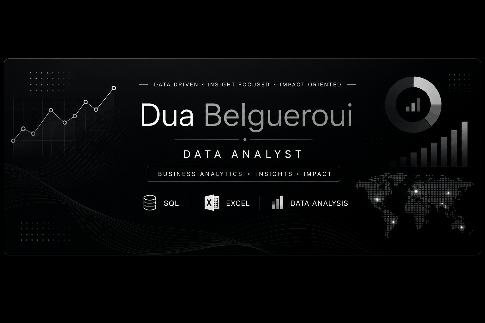

  
  

&nbsp;&nbsp;

&nbsp;&nbsp;

 Hi, I'm Dua Belgueroui 👋

## Data Analyst | SQL • Excel • Power BI

## 👩‍💻 About Me

I'm a Big Data student building my career toward Data Analytics, with a particular interest in **Business Analytics** and using data to support better decision-making.

I enjoy working through the full analytical process — from exploring and transforming data to identifying meaningful patterns and turning findings into **clear, actionable business recommendations**.

I've been developing hands-on experience through data analysis projects using **SQL, Excel, and Power BI**, including interactive dashboards and business-focused analyses. I'm continuously building my analytical, visualization, and business intelligence skills through practical projects.

## 🛠️ Skills & Tools

### 📊 Excel & Data Analysis
- Advanced Excel formulas and functions
- PivotTables and PivotCharts
- Power Query & M Code
- Power Pivot & Data Model
- DAX & calculated measures
- Slicers and Timelines
- KPI development
- Interactive dashboards
- Data cleaning and transformation
- Data visualization

### 🗄️ SQL
- Data querying and filtering
- Aggregations and grouping
- JOINs
- Subqueries and CTEs
- CASE statements
- Window functions
- Date and string functions
- Data manipulation and analysis

### 📈 Business Analytics
- Exploratory data analysis
- Trend and performance analysis
- KPI analysis
- Business-focused insights
- Translating findings into actionable recommendations

### 🔄 Currently Expanding
- Power BI
- Python
- Additional data analytics and business intelligence tools
