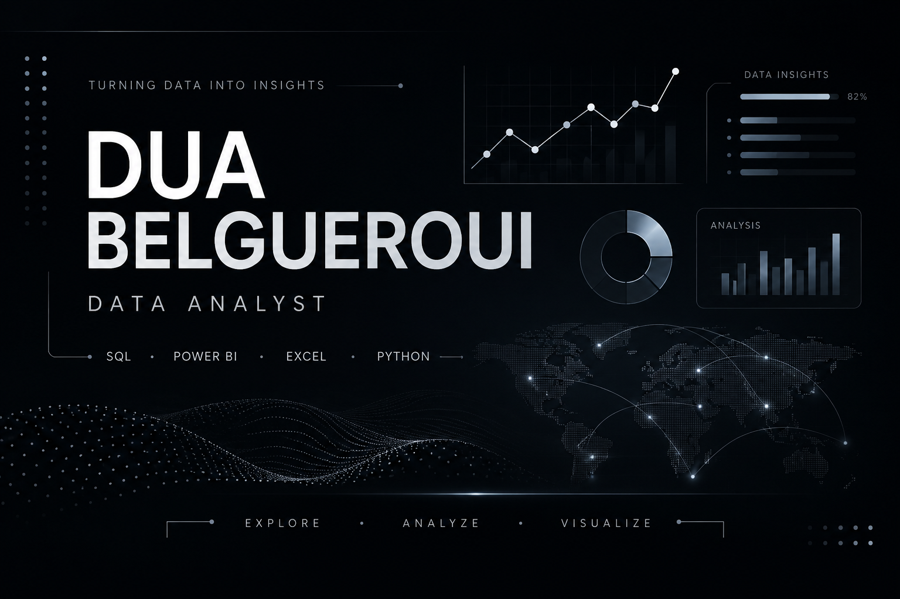

  

  
  &nbsp;&nbsp;
  
  &nbsp;&nbsp;
  

 

### A LITTLE ABOUT ME

<table>
<tr>
<td width="38%" valign="top">

<pre>
DATA / ANALYSIS              01

                         ●
                   ●─────╯
             ●─────╯
        ●────╯
   ●────╯

                       █
             █         █
        █    █    █    █
   █    █    █    █    █
──────────────────────────

EXPLORE  ·  ANALYZE  ·  VISUALIZE
</pre>

</td>
<td width="62%" valign="middle">

I'm a Big Data student working toward a career in data analysis.

I mainly work with <b>SQL, Power BI, Excel, and Python</b>, and I enjoy the part where raw data starts to actually make sense. Most of my projects are focused on cleaning data, exploring it, building dashboards, and finding insights that could be useful from a business point of view.

Right now, I'm focused on improving my analysis skills through more complete projects and working with more complex datasets.

 

<code>SQL</code> &nbsp; <code>POWER BI</code> &nbsp; <code>EXCEL</code> &nbsp; <code>PYTHON</code>

</td>
</tr>
</table>

 

- 

## 03 — SKILLS & TOOLS

### MY ANALYTICS TOOLKIT

<table>
<tr>

<td width="50%" valign="top">

### SQL

**Querying & Analysis**

`Complex Queries` · `Joins` · `Subqueries`  
`CTEs` · `Window Functions` · `Aggregations`  
`Data Exploration` · `Data Cleaning`

 

QUERY · TRANSFORM · ANALYZE

</td>

<td width="50%" valign="top">

### POWER BI

**Business Intelligence & Visualization**

`DAX` · `Measures` · `KPIs`  
`Power Query` · `Data Modeling`  
`Interactive Dashboards` · `Data Visualization`

 

MODEL · ANALYZE · VISUALIZE

</td>

</tr>

<tr>

<td width="50%" valign="top">

### EXCEL

**Analysis & Reporting**

`Power Query` · `Pivot Tables`  
`Data Cleaning` · `Data Analysis`  
`Dashboards` · `Formulas`

 

CLEAN · ANALYZE · REPORT

</td>

<td width="50%" valign="top">

### PYTHON

**Data Processing & Analysis**

`Pandas` · `NumPy`  
`Data Cleaning` · `Data Manipulation`  
`Exploratory Data Analysis`

 

PROCESS · EXPLORE · ANALYZE

</td>

</tr>
</table>

<table>
<tr>
<td>

<b>TOOLS & WORKFLOW /</b>
&nbsp;
<code>MySQL</code>
&nbsp;·&nbsp;
<code>Git</code>
&nbsp;·&nbsp;
<code>GitHub</code>
&nbsp;·&nbsp;
Data Cleaning
&nbsp;·&nbsp;
EDA
&nbsp;·&nbsp;
Data Modeling
&nbsp;·&nbsp;
KPI Analysis

</td>
</tr>
</table>

 

--- 

## 04 — SELECTED PROJECTS

### FEATURED WORK

 

### 01 / ADVENTUREWORKS SALES ANALYSIS

<code>EXCEL</code> · <code>POWER PIVOT</code> · <code>DATA MODELING</code> · <code>PIVOT TABLES</code>

  

  

An interactive Excel sales analysis exploring revenue, profitability, products, customers, and performance over time.

  

<b>KEY ANALYSIS</b>

  

Revenue & Profitability &nbsp;&nbsp;·&nbsp;&nbsp; Product Performance  
Customer Analysis &nbsp;&nbsp;·&nbsp;&nbsp; Time-Based Trends  
Profit Margins &nbsp;&nbsp;·&nbsp;&nbsp; KPI Tracking

  

<a href="YOUR-PROJECT-LINK-HERE"><b>VIEW PROJECT ↗</b></a>

  

---
