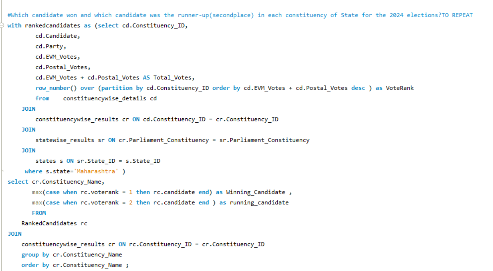
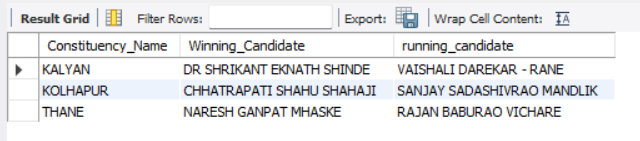
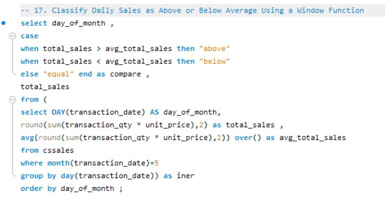
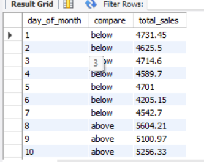

  

  
  &nbsp;&nbsp;
  
  &nbsp;&nbsp;
  

 

### A LITTLE ABOUT ME

<table>
<tr>
<td width="38%" valign="top">

<pre>
DATA / ANALYSIS              01

                         ●
                   ●─────╯
             ●─────╯
        ●────╯
   ●────╯

                       █
             █         █
        █    █    █    █
   █    █    █    █    █
──────────────────────────

EXPLORE  ·  ANALYZE  ·  VISUALIZE
</pre>

</td>
<td width="62%" valign="middle">

I'm a Big Data student working toward a career in data analysis.

I mainly work with <b>SQL, Power BI, Excel, and Python</b>, and I enjoy the part where raw data starts to actually make sense. Most of my projects are focused on cleaning data, exploring it, building dashboards, and finding insights that could be useful from a business point of view.

Right now, I'm focused on improving my analysis skills through more complete projects and working with more complex datasets.

 

<code>SQL</code> &nbsp; <code>POWER BI</code> &nbsp; <code>EXCEL</code> &nbsp; <code>PYTHON</code>

</td>
</tr>
</table>

 

 

## 03 — SKILLS & TOOLS

### MY ANALYTICS TOOLKIT

<table>
<tr>

<td width="50%" valign="top">

### SQL

**Querying & Analysis**

`Complex Queries` · `Joins` · `Subqueries`  
`CTEs` · `Window Functions` · `Aggregations`  
`Data Exploration` · `Data Cleaning`

 

QUERY · TRANSFORM · ANALYZE

</td>

<td width="50%" valign="top">

### POWER BI

**Business Intelligence & Visualization**

`DAX` · `Measures` · `KPIs`  
`Power Query` · `Data Modeling`  
`Interactive Dashboards` · `Data Visualization`

 

MODEL · ANALYZE · VISUALIZE

</td>

</tr>

<tr>

<td width="50%" valign="top">

### EXCEL

**Analysis & Reporting**

`Power Query` · `Pivot Tables`  
`Data Cleaning` · `Data Analysis`  
`Dashboards` · `Formulas`

 

CLEAN · ANALYZE · REPORT

</td>

<td width="50%" valign="top">

### PYTHON

**Data Processing & Analysis**

`Pandas` · `NumPy`  
`Data Cleaning` · `Data Manipulation`  
`Exploratory Data Analysis`

 

PROCESS · EXPLORE · ANALYZE

</td>

</tr>
</table>

<table>
<tr>
<td>

<b>TOOLS & WORKFLOW /</b>
&nbsp;
<code>MySQL</code>
&nbsp;·&nbsp;
<code>Git</code>
&nbsp;·&nbsp;
<code>GitHub</code>
&nbsp;·&nbsp;
Data Cleaning
&nbsp;·&nbsp;
EDA
&nbsp;·&nbsp;
Data Modeling
&nbsp;·&nbsp;
KPI Analysis

</td>
</tr>
</table>

 

 

## 04 — SELECTED PROJECTS

### FEATURED WORK

 

## 01 / OLIST BRAZILIAN E-COMMERCE ANALYSIS

<code>POWER BI</code> · <code>POWER QUERY</code> · <code>DAX</code> · <code>DATA MODELING</code> · <code>BUSINESS ANALYTICS</code>

**FEATURED PROJECT — FOUR-PAGE BUSINESS INTELLIGENCE REPORT**

An end-to-end analysis of a Brazilian e-commerce marketplace, connecting **sales performance, product drivers, customer and payment behavior, and delivery outcomes**. Built on a multi-table data model, with interactive visualizations, dynamic measures, and a detailed analytical case study.

**PROJECT HIGHLIGHTS**

- **Sales & demand:** R$6.16M in sales and 45.10K orders in the selected 2017 view, with monthly trends and weekday/hourly demand analysis.
- **Product performance:** Category contribution, Pareto analysis, volume versus average selling price, and month-over-month momentum.
- **Customers & payments:** New versus returning orders, geographic concentration, payment methods, and installment behavior.
- **Delivery & reviews:** Late-delivery rates, fulfillment stages, geographic differences, and review scores by delay severity.

**TECHNICAL FOCUS**

Multi-Table Modeling &nbsp;·&nbsp; Data Cleaning & Validation &nbsp;·&nbsp; DAX & Time Intelligence  
Field Parameters &nbsp;·&nbsp; Custom Tooltips &nbsp;·&nbsp; Interactive Reporting

&nbsp;

  

---

## 02 / ADVENTUREWORKS SALES ANALYSIS

<code>EXCEL</code> · <code>POWER PIVOT</code> · <code>DATA MODELING</code> · <code>PIVOT TABLES</code>

 

An interactive Excel sales analysis exploring revenue, profitability, products, customers, and performance over time.

<b>KEY ANALYSIS</b>

Revenue & Profitability &nbsp;&nbsp;·&nbsp;&nbsp; Product Performance  
Customer Analysis &nbsp;&nbsp;·&nbsp;&nbsp; Time-Based Trends  
Profit Margins &nbsp;&nbsp;·&nbsp;&nbsp; KPI Tracking

  

---
## 03 / INDIA ELECTIONS 2024 ANALYSIS

<code>SQL</code> · <code>MYSQL</code> · <code>CTEs</code> · <code>WINDOW FUNCTIONS</code> · <code>JOINS</code>

<table>
<tr>
<td width="62%" valign="top">

SQL / ANALYSIS

### WINNER & RUNNER-UP BY CONSTITUENCY

</td>

<td width="38%" valign="top">

MYSQL / OUTPUT

### QUERY RESULT

</td>
</tr>
</table>
A SQL analysis of the 2024 India election results exploring party and alliance performance, state-level results, constituency outcomes, and candidate performance.

<b>KEY ANALYSIS</b>

Party & Alliance Performance &nbsp;·&nbsp; State-Level Results  
Constituency Analysis &nbsp;·&nbsp; Candidate Vote Analysis  
Seat Distribution &nbsp;·&nbsp; Winner & Runner-Up Ranking

---
## 04 / COFFEE SHOP SALES ANALYSIS

<code>SQL</code> · <code>MYSQL</code> · <code>POWER BI</code> · <code>DAX</code> · <code>DATA MODELING</code>

<table>
<tr>
<td width="62%" valign="top">

SQL / ANALYSIS

### DAILY SALES VS AVERAGE

</td>

<td width="38%" valign="top">

MYSQL / OUTPUT

### QUERY RESULT

</td>
</tr>
</table>

 

POWER BI / DASHBOARD

### COFFEE SHOP SALES DASHBOARD

Interactive Power BI dashboard covering sales performance, MoM growth, store performance, product analysis, daily trends, and day/hour patterns.

An end-to-end sales analysis combining SQL and Power BI to explore sales performance, transaction patterns, product performance, store locations, and time-based trends.

<b>KEY ANALYSIS</b>

Sales & Order Performance &nbsp;·&nbsp; Month-over-Month Growth  
Store Location Performance &nbsp;·&nbsp; Product & Category Analysis  
Daily Sales Trends &nbsp;·&nbsp; Day & Hour Analysis

---

### MORE PROJECTS

<table>
<tr>
<td width="50%" valign="top">

<b>BUS TRANSPORTATION ANALYSIS</b>

<code>EXCEL</code> · <code>POWER PIVOT</code> · <code>DATA MODELING</code>

Ridership, route performance, utilization, and operational analysis.

</td>

<td width="50%" valign="top">

<b> INSURANCE RISK & CLAIMS ANALYSIS </b>

<code>POWER BI</code> · <code>DAX</code> ·  <code>DATA MODELING</code> · <code>FIELD PARAMETERS</code>

Insurance policies, claims, customer characteristics, and risk patterns across different policyholder segments.

</td>
</tr>
</table>

 

---
## 05 — LET'S CONNECT

### GET IN TOUCH

I'm always open to connecting, discussing data projects, or exploring new opportunities.

  
  &nbsp;&nbsp;
  
  &nbsp;&nbsp;
  

---

  DATA · ANALYSIS · BUSINESS INSIGHTS

